# 💰 CoinWise — LLM-Powered Mobile Finance App

**CoinWise** is a cross-platform mobile budgeting app that automatically extracts structured transactions from messy bank statement text using a **multi-step LLM prompting pipeline**.  
It helps users **track expenses, manage budgets and goals, and visualize financial insights** — all with a clean, intuitive mobile interface.

---

## ⚙️ Tech Stack

**Frontend:** React Native (TypeScript)  
**Backend:** FastAPI (Python)  
**Auth & DB:** Supabase (Auth + PostgreSQL)  
**LLM:** LLaMA Maverick Instruct 4 (via API) with JSON Schema validation to reduce hallucinations  
**Monorepo:** `coinwise-frontend/` + `coinwise-backend/`

---

## 🚀 Features

- 🧠 **LLM-based transaction extraction** — multi-stage prompt pipeline that normalizes, parses, classifies, and validates transactions.  
- 💸 **Full CRUD for budgets, goals, and transactions**.  
- 📊 **Spending analytics dashboard** with category breakdowns and trends.  
- 🔐 **Secure authentication** via Supabase Auth.  
- 📱 **Mobile-first UX** with dedicated screens for Transactions, Budgets, Goals, and Statistics.

---

## 🧩 Architecture Overview

```text
React Native (TypeScript)
 ├─ Auth & UI Screens
 ├─ Transactions | Budgets | Goals | Stats
 └─ REST calls → FastAPI backend

FastAPI (Python)
 ├─ /ingest → multi-step LLM pipeline
 │     1) clean input  2) extract  3) categorize  4) validate JSON schema
 ├─ CRUD endpoints for budgets/goals/transactions
 └─ Supabase client + Postgres persistence
```
## 🖼️ App Images

### 🏠 Home Page
<p align="center">
  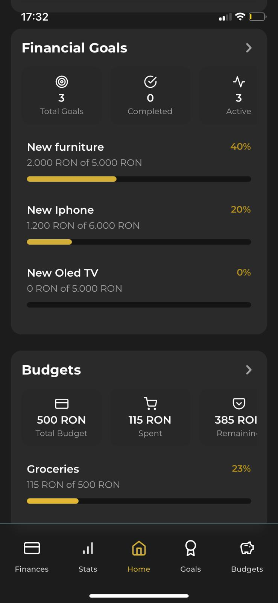
  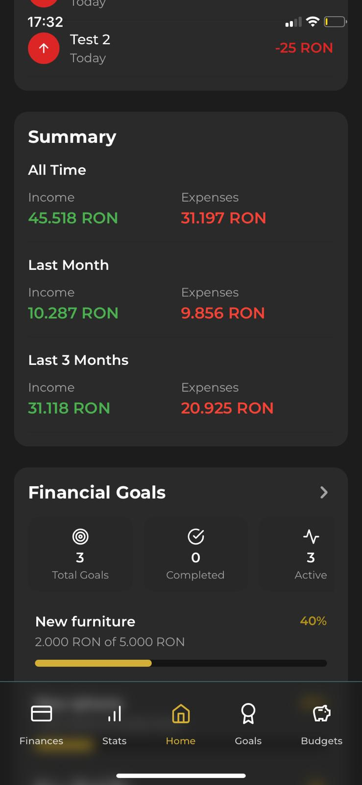
  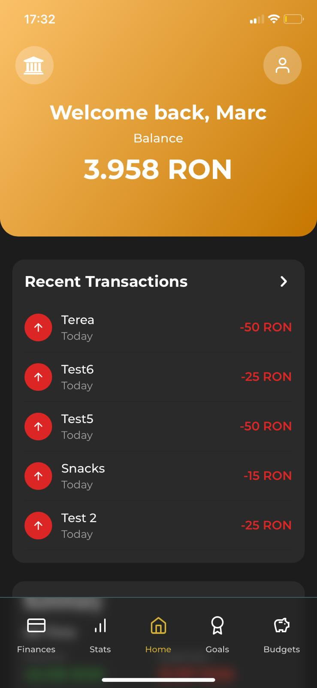
</p>

---

### 💳 Transactions Page
<p align="center">
  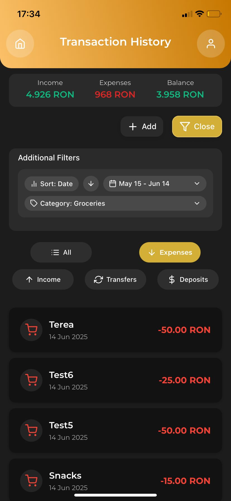
  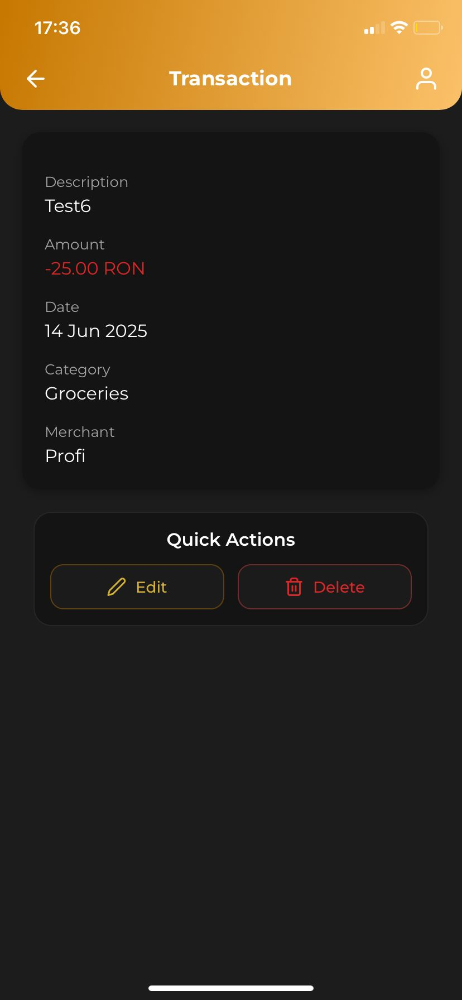
  
</p>

---

### 💰 Budgets Page
<p align="center">
  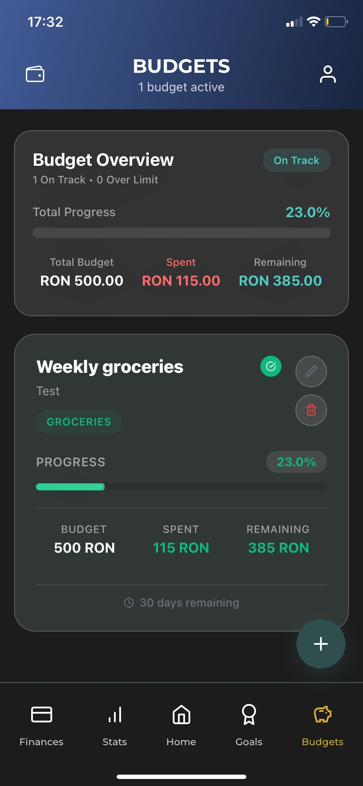
  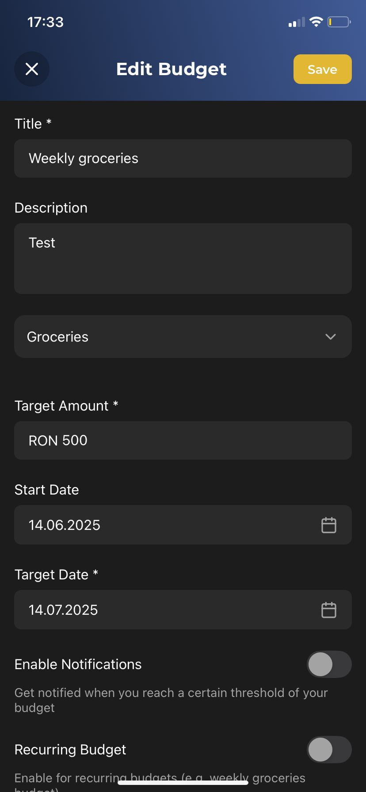
  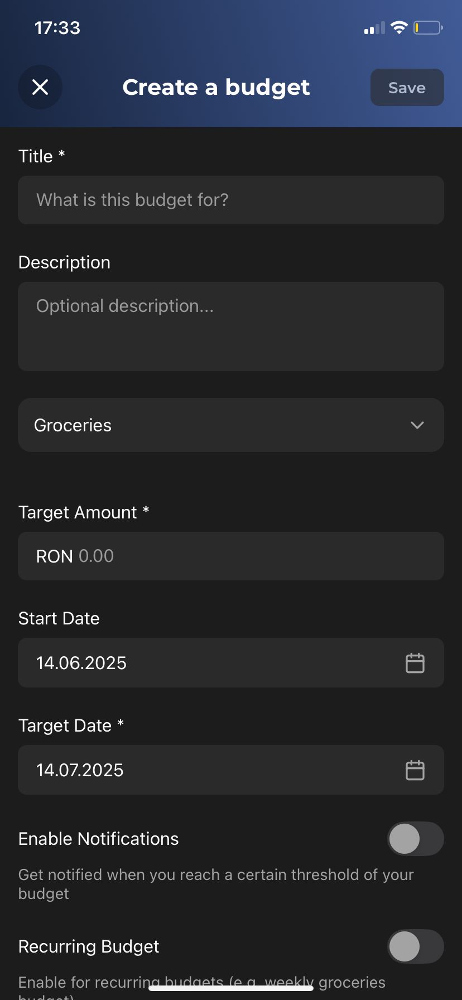
 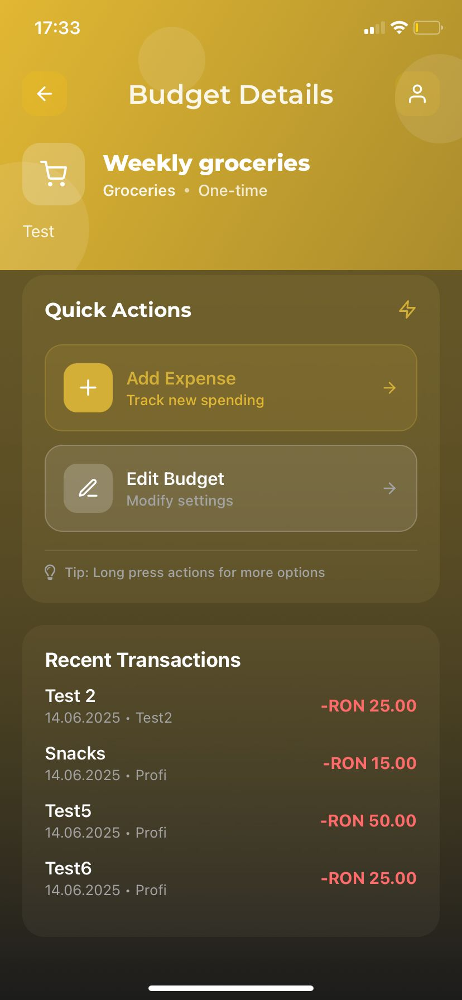
</p>

---

### 🎯 Goals Page
<p align="center">
  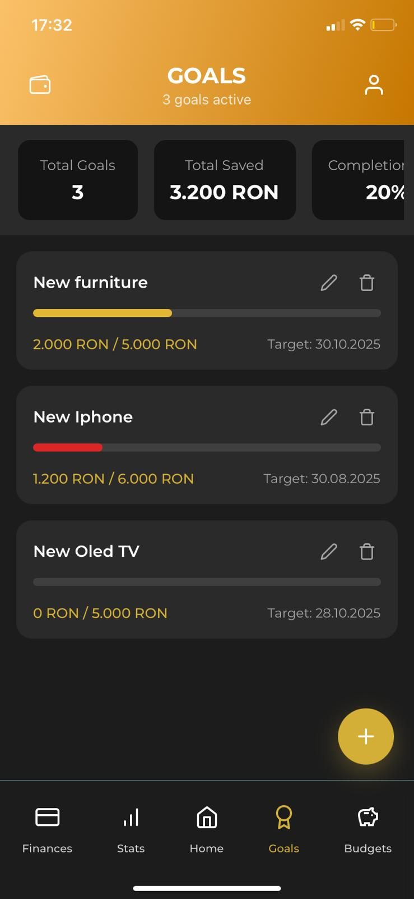
  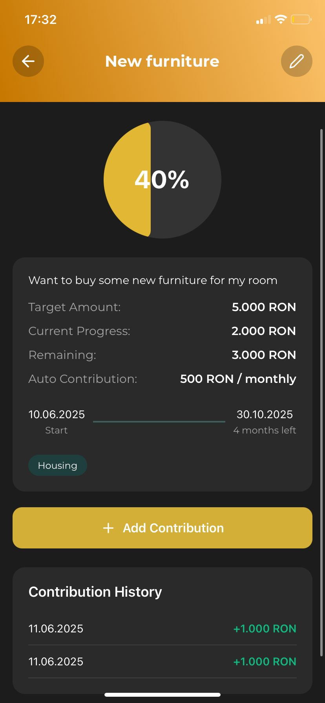
  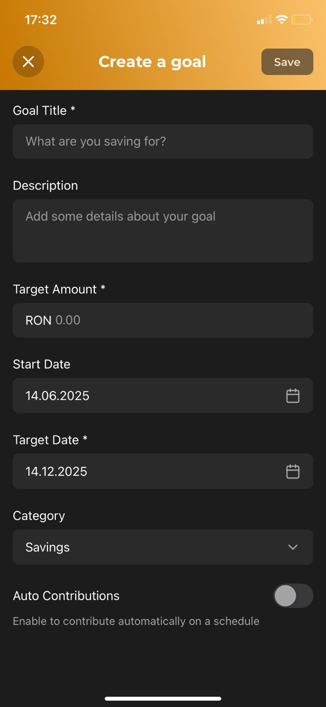
  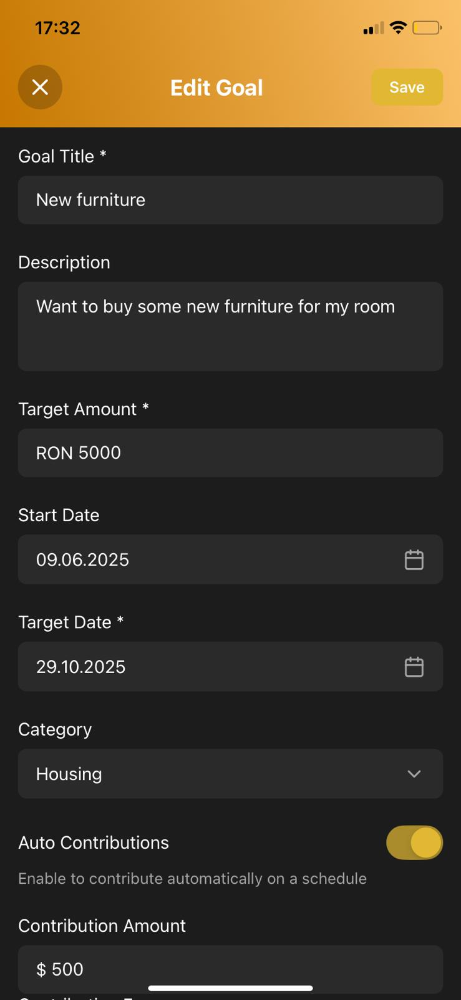
</p>

### 📊 Statistics Page
<p align="center">
  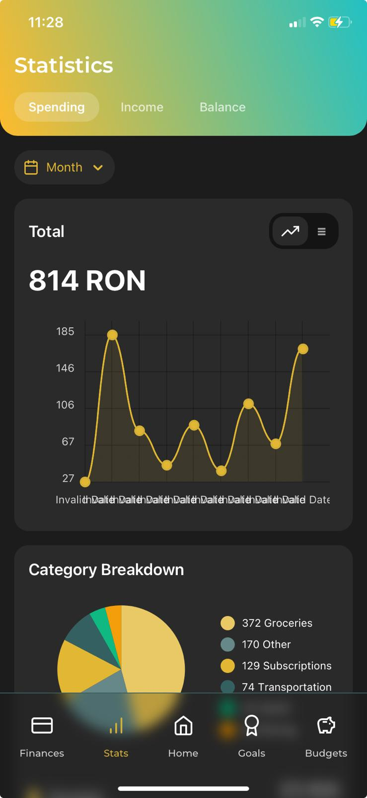
  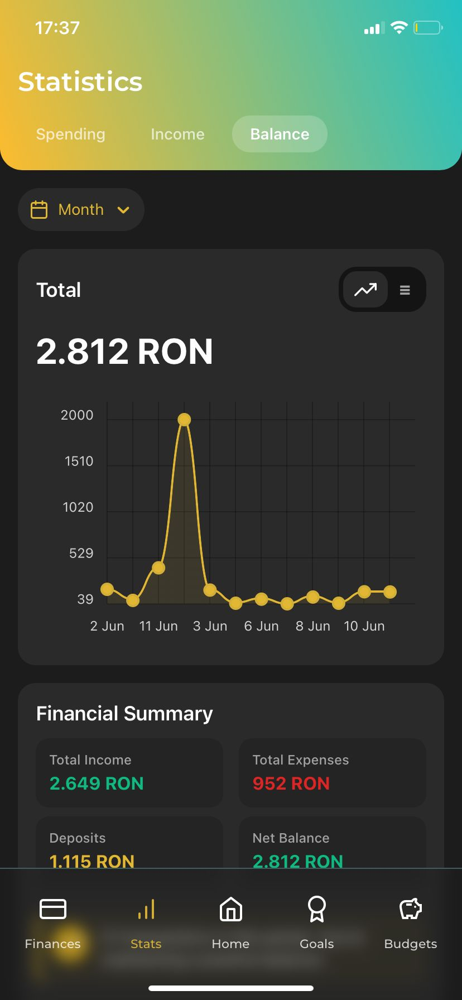
  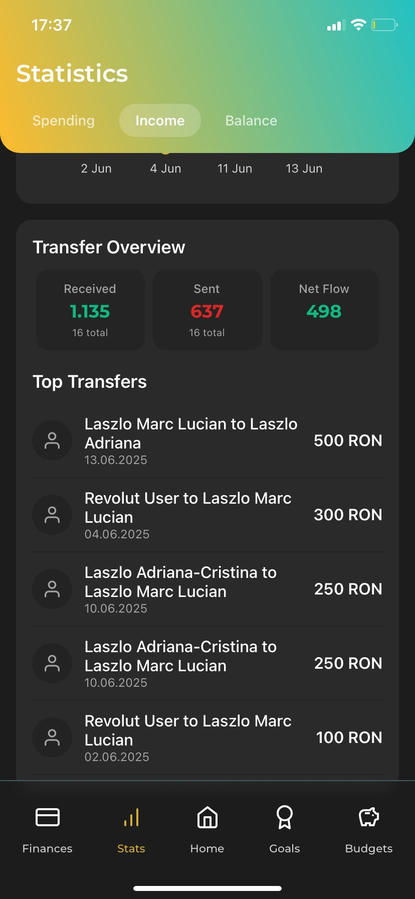
  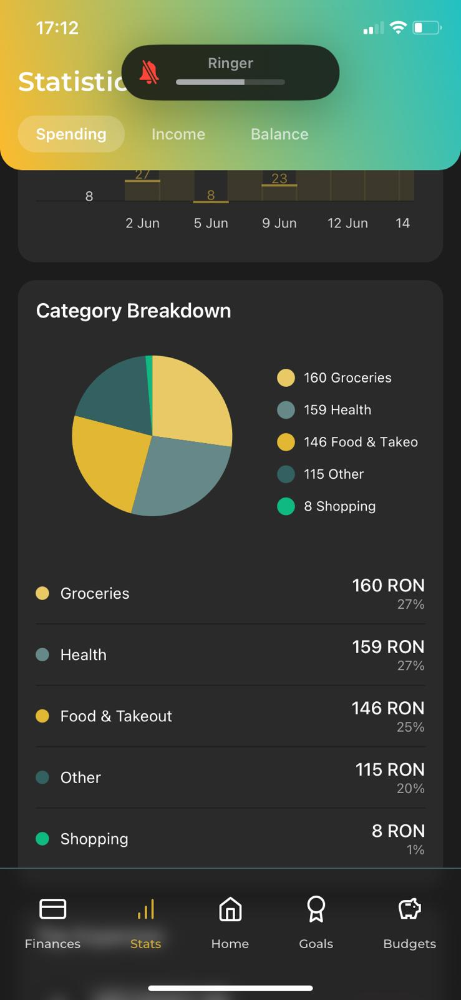
</p>

